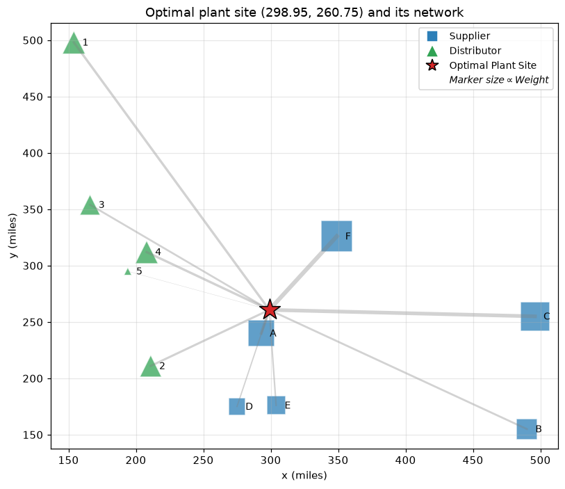
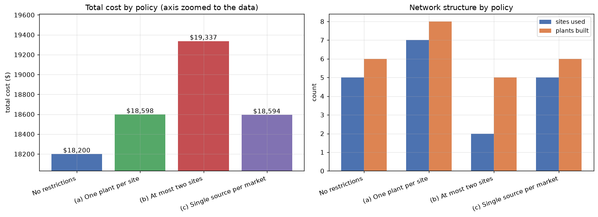
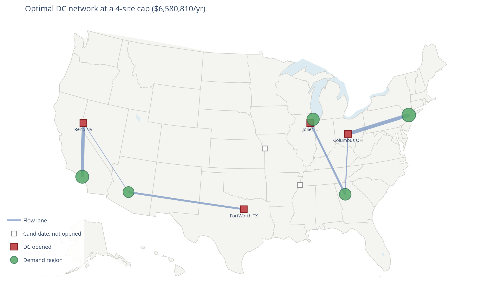

# Facility Location Optimization

Optimization models for facility siting and distribution network design, built in Python
with SciPy and Gurobi. Three notebooks, ordered by scope: siting a single facility, then
choosing plants and market assignments under competing policy constraints, then designing
a distribution network with sensitivity analysis.

Each notebook is self-contained, the data is defined inline, and every result is reproduced by
running the notebook top to bottom. Outputs are committed, so the models can be read
without installing a solver.

---

## Notebooks

### 1. [Single-Facility Siting: Weighted Median Problem and the Gravity Model](01_single_facility_siting_gravity_model.ipynb)

Siting one new plant to minimise total weighted transportation cost against 11 existing
facilities, six suppliers and five distributors, each with its own freight rate and
shipment volume. The problem is solved two ways and the results compared: directly as a
convex nonlinear program, and iteratively with the gravity model (Weiszfeld's algorithm)
started from the origin.

**Model:** Continuous nonlinear — weighted Weber / weighted median problem, Euclidean distances



| | Location | Total cost |
| --- | --- | ---: |
| Convex optimum | (298.95, 260.75) | $36,755.49 |
| Gravity model, 10 iterations | (299.15, 261.27) | $36,755.63 |

The two methods agree to within $0.14, a relative gap under 0.0004%, and the gravity
model lands within about a mile of the optimum after a single iteration. Siting the plant
at the origin instead would cost roughly $121,000, so the siting decision is worth about
two-thirds of the freight bill.

---

### 2. [Capacitated Plant Location with Discrete Capacity Tiers](02_capacitated_plant_location_mip.ipynb)

An electronics company choosing where to build plants to supply nine markets. Seven
candidate sites are available, and each can host any subset of three capacity tiers: low,
medium and high, so capacity at a site is built up in discrete blocks rather than chosen
from a menu. The base model is solved, then re-solved under three independent policy
restrictions and priced against the unrestricted optimum.

**Model:** Mixed-integer linear program — binary build variables linked to continuous flows through the capacity constraint



| Policy | Total cost | Premium | Sites used | Plants built |
| --- | ---: | ---: | ---: | ---: |
| Base case — no restrictions | $18,200 | — | 5 | 6 |
| (a) At least one plant per site | $18,598 | +$398 (2.19%) | 7 | 8 |
| (b) At most two sites | $19,337 | +$1,137 (6.25%) | 2 | 5 |
| (c) Single source per market | $18,594 | +$394 (2.16%) | 5 | 6 |

Restrictions (a) and (c) cost almost the same but work differently: (a) spreads production
across all seven sites, while (c) keeps the base footprint and only stops markets from
sharing a supplier. Consolidating to two sites is roughly three times more expensive than
either, driven by longer hauls rather than by fixed cost.

---

### 3. [Warehouse Network Design: Capacitated Facility Location with a Site Cap](03_warehouse_network_design_mip.ipynb)

A distribution business choosing which of six candidate distribution centres to open to
serve five regional demand clusters, subject to a cap on how many DCs the network may run.
Lane costs are derived from geography, the distances are computed with the haversine formula
from site coordinates rather than entered by hand. Includes two sensitivity studies and a
look at formulation strength.

**Model:** Capacitated facility location with a cardinality constraint



Optimal network at a four-site cap — Joliet IL, Columbus OH, Fort Worth TX, Reno NV:

| Component | Annual cost |
| --- | ---: |
| Fixed (site) cost | $1,075,000 |
| Handling | $942,500 |
| Outbound freight | $4,563,310 |
| **Total** | **$6,580,810** |

- Freight is roughly two-thirds of annual spend, so the model opens sites readily — each
  additional DC buys back expensive miles.
- Capacity, not cost, sets the minimum footprint: fewer than four DCs is infeasible. The
  fifth site is worth about $155,000 a year; a sixth is worth nothing.
- Nearest-DC assignment is not optimal, the capacity limits split Atlanta across two DCs and
  push part of Phoenix onto a farther site because the nearer one is full.
- The optimal footprint shifts from four DCs to five as the line-haul rate rises past
  roughly $0.006 per unit-mile, so the useful deliverable is a threshold rather than a
  single point answer.
- Adding lane-level variable upper bounds cuts the LP integrality gap from 8.4% to 0.6%
  without changing the optimal solution, a reformulation that matters for runtime once
  the network grows beyond a handful of sites.

---

## Requirements

| Library | Used for | Notebooks |
| --- | --- | --- |
| `pandas` | data tables and solution reporting | 1, 2, 3 |
| `numpy` | numerical arrays, haversine distances | 1, 2, 3 |
| `matplotlib` | static charts | 1, 2 |
| `scipy` | convex optimization (`scipy.optimize.minimize`) | 1 |
| `gurobipy` | mixed-integer programming | 2, 3 |
| `plotly` | interactive network map and sensitivity charts | 3 |
| `jupyterlab` | running the notebooks | 1, 2, 3 |

```bash
pip install pandas numpy matplotlib scipy gurobipy plotly jupyterlab
```

### Solver

Notebooks 2 and 3 use Gurobi. The `pip install gurobipy` package ships with a size-limited
licence covering models up to 2,000 variables and 2,000 constraints, well beyond what
these instances need, so no separate licence is required to reproduce the results.
Notebook 1 uses only SciPy and needs no solver.

Both mixed-integer models translate directly to `pulp` with CBC or to `python-mip` if you
prefer an open-source solver; the formulations in the markdown cells are solver-agnostic.

### Interactive charts

Notebook 3 uses Plotly for its network map and sensitivity charts. GitHub's notebook
preview does not execute embedded JavaScript, so these will not render on GitHub. To view
them, run the notebook locally or paste its URL into [nbviewer.org](https://nbviewer.org).

---

## Running the notebooks

```bash
git clone https://github.com/<your-username>/facility-location-optimization.git
cd facility-location-optimization
pip install -r requirements.txt
jupyter lab
```

All data is defined inline in the notebooks, these instances are small enough that keeping
the data beside the model is clearer than loading it from separate files.

---

## Repository layout

```
facility-location-optimization/
├── 01_single_facility_siting_gravity_model.ipynb
├── 02_capacitated_plant_location_mip.ipynb
├── 03_warehouse_network_design_mip.ipynb
├── figures/
│   ├── single_facility_siting.png
│   ├── plant_location_policy_comparison.png
│   └── warehouse_network_map.png
├── requirements.txt
├── LICENSE
└── README.md
```

## Licence

MIT — see [LICENSE](LICENSE).
